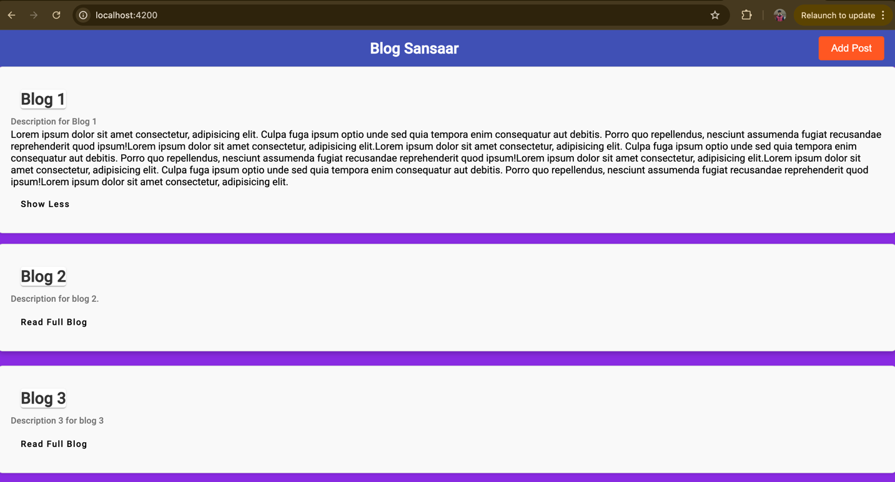

# BlogWeb

This project was generated with [Angular CLI](https://github.com/angular/angular-cli) version 17.0.5.

## Development server

Run `ng serve` for a dev server. Navigate to `http://localhost:4200/`. The application will automatically reload if you change any of the source files.

## Code scaffolding

Run `ng generate component component-name` to generate a new component. You can also use `ng generate directive|pipe|service|class|guard|interface|enum|module`.

## Build

Run `ng build` to build the project. The build artifacts will be stored in the `dist/` directory.


### BACKEND : SPRING BOOT

Clone the project : rest-blog-api

```bash
git clone https://github.com/kafleprakash96/rest-api-blog.git
```

Run the spring boot application

Use api `http://localhost:8080/api/posts` to save some data or manually add some information in database.

After running the Spring boot and Angular application. You will see something like below with your backend data.



Click on Add Post button on top right to create new post.


Verify the data in the database.


